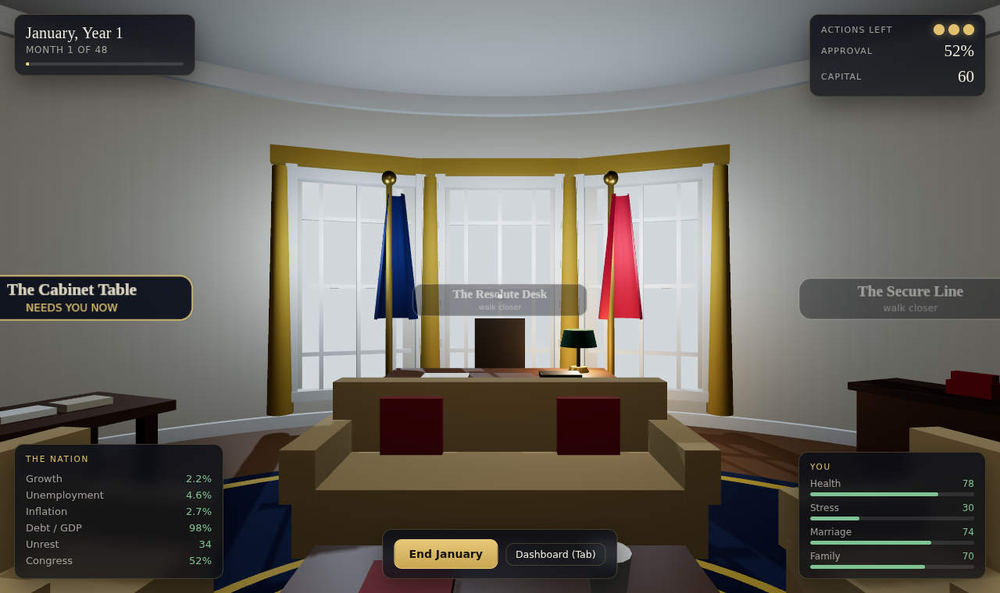

# Oval

A single-player 3D president simulator. You have four years, forty-eight months,
and two or three meaningful decisions a month. The nation needs a budget it
cannot afford, a Congress that owes you nothing, and an answer to whatever broke
overnight. Upstairs, your family would like to see you occasionally.

The whole game is the tension between those two facts.



## Playing

```bash
npm install
npm run dev      # http://localhost:5173
```

You walk six rooms in first person, and each one does what that room really
does. Doors on the floor take you between them; the number keys walk you
straight to a station, wherever it lives.

| Room | Station | What happens there |
| --- | --- | --- |
| **The Oval Office** | The Resolute Desk | Executive orders, clemency, vetoes: what you can do alone |
| | The Secure Line | Allies, summits, trade deals, the intelligence brief |
| **The Cabinet Room** | The Cabinet Table | The annual budget: nine agencies and the tax rate |
| | The West Wing | Cabinet meetings, fundraisers, reshuffles |
| **The Capitol** | The House Floor | Bringing a bill to a vote, and whipping it, in front of the chamber |
| **The Briefing Room** | The Press Pool | Addresses, hostile interviews, rallies, campaign swings |
| **The Residence** | Upstairs | Your family by name: their evenings, and what they are carrying |
| **The Private Study** | Yourself | Sleep debt, fitness, the physician, and an hour that is yours |

The rooms are not empty. Your six named secretaries are round the Cabinet
table, your family is upstairs, a press corps fills the briefing room, and the
House chamber holds a hundred members seated in their five faction blocks. They
breathe, blink, shift their weight, and turn to look at you when you walk in.

**Controls** — `W A S D` and the mouse to move and look, `E` to use what you are
standing at or to walk through the door you are standing in, `1`–`8` to go
straight to a station in whatever room it lives in, `Tab` for the dashboard,
`Enter` to end the month, `Esc` to close a panel. Click an object in the room to
open it, or click empty space to capture the mouse. Everything is reachable from
the keyboard alone, and on a touch screen from a thumb alone.

Progress saves to `localStorage` after every action.

## How the simulation works

Each month ticks a connected model rather than a table of random events.

**The economy.** Potential growth comes out of infrastructure, education and
research quality, minus the tax burden, the debt overhang and civil unrest. A
business cycle and a random shock ride on top, and a central bank leans against
inflation with rate rises that cost you growth. Unemployment follows growth,
prices follow demand and the deficit, and nominal GDP compounds.

**The budget.** Every agency drifts toward the quality its funding supports, and
the cost of standing still rises about 0.3% a month. Freezing a budget is a slow
cut. Revenue is the tax rate against GDP; the gap becomes debt, and the debt
charges interest that rises with inflation and leverage. The opening books run a
deficit of roughly 6% of GDP, so the debt grows unless you do something about it.

**Approval is a coalition, not a number.** Eight constituencies each hold their
own opinion of you — labour, business, seniors, younger voters, rural,
suburban, the activist left and the traditionalist right — weighted by their
share of the electorate. Each one drifts toward a target computed from the
things that bloc actually cares about: labour reads unemployment, wages and
welfare; business reads growth, the tax rate and the debt; seniors read
healthcare and prices; the suburbs read schools, crime and the absence of
scandal. Approval is what the arithmetic adds up to, compressed toward the
middle because the country is polarised, and shaded by your character and the
press.

Every bloc also carries a standing lean for or against your party, so part of
the country is never coming home however well you govern. Your own party's mood
follows its base rather than the country at large, and elections are decided
bloc by bloc with turnout that rises with enthusiasm — a constituency that has
given up on you stays home, which cuts both ways.

This makes policy genuinely two-sided. Nearly every bill and most crisis choices
move specific constituencies in opposite directions: the wealth surtax buys the
left and labour and costs you business badly; energy independence buys rural and
business and loses the young; imposing a rail settlement gets the trains running
and turns labour against you for the rest of the term. The dashboard shows the
whole coalition, sorted, with a live re-election forecast.

**Congress is five factions, not a support percentage.** The hundred seats are
split between the Progressive Caucus, the Liberal Bloc, the Moderates, the
Conservative Bloc and the Hardliners. Each sits somewhere on a left-to-right
axis, holds a mood toward you, and follows its own constituency: the
Progressives take their cue from the activist left, the Conservatives from
business, the Hardliners from traditionalists, and the Moderates — a genuine
swing bloc with no party loyalty at all — from the suburbs and from the
country's verdict on you.

A bill is scored faction by faction. Ideological distance does most of the
work and rises steeply, so a faction one step away can be bought and one on the
far flank is not voting for this at any price. On top of that sit the faction's
mood, whether the bill is on its home turf, what the bill costs (deficit hawks
punish spending nearly four times harder, and harder still above 110% debt), how
divisive it is, and the capital you commit to whipping. Every faction's odds are
shown on the bill card as a whip board, with the expected vote count out of a
hundred; fifty carries it, and the floor adds twelve points of noise either way,
so a close count is a real gamble.

The practical shape of it: your own signature agenda is the hard one. A
progressive bill under a blue president locks up the left and gets nothing from
the Moderates until their mood has risen and you spend most of your capital
whipping. Centrist bills pass. Bills written for the other party are close to
impossible, which is what having a party means. Midterm losses move actual seats
between the flanks, so a bad November changes every count that follows.

**The cabinet has names.** Six secretaries — chief of staff, treasury, state,
defense, justice, health — each with a competence, a loyalty, and a faction they
came from. Competence is what turns money into delivery: a strong cabinet lifts
every agency's output, a good treasury secretary adds to growth, and the
department that owns a crisis takes the edge off its risk of going wrong.
Appointments are patronage, so the factions your people came from warm to you.

Loyalty only ever erodes. It falls faster when you are unpopular, mired in
scandal or facing unrest, slower when your party is behind you, and a little
faster every month someone has served. A secretary who has stopped believing in
you either walks — costing capital, approval and a week of coverage — or talks
to a reporter, which is worse. A steady presidency keeps its cabinet for four
years. A failing one loses most of it.

**Crises** are weighted by pressure derived from state, so they are consequences
rather than dice. Underfund the environment and the fire seasons get worse;
underfund healthcare and the overdose surge arrives; let unrest and scandal build
and the leaks and challengers follow. Some options carry an explicit risk of
backfiring.

**Crises also cause each other**, through three connected mechanisms.

*Situations* are crises that outlive the meeting they started in. Commit troops
to a treaty ally and you open a war that runs for the rest of the term, bleeding
debt and approval every month, ageing you, and generating its own crises —
casualty convoys, protests in the square, a coalition that wants an exit ramp.
Each has an intensity that drifts up if ignored and down if handled, and its
effects scale with it, so a war winding down hurts less than one at its height.
Impose a rail settlement and labour organises against you. Downplay an outbreak
badly and you get an epidemic *and* the inquiry into how you handled it.

*Consequence crises* exist only as results. Nine of the twenty-eight can never
fire on their own: they are unlocked by a specific decision. Stonewall a leak and
lose the gamble, and the investigation you opened can end in drafted articles of
impeachment. Fix a grid intrusion quietly, and what you knew and when becomes a
story of its own.

*Domain heat* clusters trouble. Every crisis is tagged by domain, and a crisis
raises the temperature of its own domains, as does any running situation. Hot
domains produce more crises and cool off over a few months when nothing feeds
them — so the country has bad years in particular areas rather than uniformly
random trouble.

Running situations show on a board in the HUD and in the dashboard, and a crisis
produced by one says which, so trouble can be traced back to the decision that
caused it.

**Your family are people, not two numbers.** A spouse and two children,
generated with the run's seed: names, ages, and a life each of them is living
whether you are in it or not — a surgery practice down to one clinic a month, a
nineteen-year-old on a gap year somewhere with bad reception, a teenager
furious about the security detail. Each carries a bond with you, and marriage
and family are readouts of those people the same way approval is a readout of
the constituencies.

The residence generates its evenings from the family you actually have, so it
offers "Take Elena out" and "Show up for Maya", each with its own cooldown:
seeing one of them is not seeing the others. An hour lands on the person you
gave it to.

Bonds erode with absence, and absence is counted per person — the months since
you last gave *them* an evening. In the gaps you leave, they pick up strains of
their own: a child coming apart at school, a spouse losing themselves in the
role, someone trading on the surname, someone not picking up. A strain festers
while you are elsewhere and eases when you are there, and what your family is
carrying you are carrying too — it feeds straight back into your stress. Left
long enough it arrives at the residence as a decision with their name on it.
Absence saturates rather than running to zero: a person you have not seen in a
year is distant, not erased, and the door is still open when you finally walk
through it.

The country notices. A first family that is visibly close is worth something
with the suburbs and traditionalists; one that is never in the same room costs
you with both, and eventually becomes a story.

**Your body is a body.** Health is no longer one bar. Sleep debt accumulates
with crises and stress and recovers a little on its own, so it settles at a
level rather than running to a hundred — and that level is the point. Fitness
falls toward what a schedule like this leaves you with unless you spend a
morning a week on it. Both feed health, and past a threshold sleep debt costs
you an action point outright.

A full physical is the only thing that finds a condition before it finds you:
atrial fibrillation, a coronary narrowing they want watched. Once diagnosed
there is a plan, and the plan costs you schedule. Ignore all of it and the body
collects on its own terms — a week at Walter Reed, the Vice President signing
three things, and a country told it was precautionary.

Measured over full terms: a president who goes upstairs ends with an average
family bond of 80, three residence crises across four years, and almost never
sees the inside of a hospital. One who never does ends at 25, takes fourteen
residence crises, and has about two health episodes — with roughly a one in
three chance of resigning on medical advice before the term is out.

**Endings.** The term can end early through medical resignation, impeachment, or
a collapse of the ability to govern. Otherwise you reach the election, having
decided in year three whether to run at all, and get a legacy score across the
economy, society, the world, politics and your own life.

## Sound

Every sound in the game is synthesised at runtime with the Web Audio API.
Nothing is sampled, so the whole soundscape costs no download, no licence and
no asset pipeline — which matters when the game ships as one HTML file and a
small APK.

**Positional ambience.** The fire is a filtered noise bed with crackles
scheduled on top; the grandfather clock is silent between ticks, alternating
tick and tock so it reads as a pendulum. Both are `PositionalAudio` sources
anchored to their furniture, so they fall away as you cross the room. Under all
of it sits a barely-there room tone: lowpassed noise at the edge of hearing.

**The rest is feedback.** Footsteps trigger on distance walked rather than a
timer, so they land with the walking. A warm major arpeggio for a bill signed,
a descending minor one for a bill dead on the floor, two urgent pulses when a
crisis breaks, and a soft bell to close the month.

Ambient timing runs off the audio clock, not accumulated frame deltas — the
render loop clamps its delta to stop the player teleporting after a tab switch,
and a clock driven by that would tick in slow motion on a slow device.

Sound starts on the click that takes the oath, because browsers will not open
an audio context any other way, and the mute preference persists.

## The people

There is no CC0 source of good human models with faces, so the cast is
generated in code. Each person is built from a seed taken from their name, so a
given secretary looks the same every time you walk into the Cabinet Room.

The head is a sphere pushed into a skull — brow ridge, cheekbones, eye sockets,
a nose, a jaw that tapers to a chin — and the face is painted onto its UVs.
Both are driven from **one set of anatomical landmarks** expressed as directions
on that sphere, so the painted brows sit on the brow ridge and the eyeballs sit
in the sockets the sculpt actually made; neither can drift away from the other.
The hair is a shell built from the same deform function, cut at a hairline that
is higher across the forehead than at the sides, so long hair never ends up
hanging over the eyes.

The body is a real joint hierarchy — hips → spine → chest → neck → head, and
chest → shoulder → upper arm → forearm → hand — laid out on human proportions
(hip 0.92m, shoulder 1.44, chin 1.52, eyes 1.63, crown 1.75 for a 1.75m
person). Posing and animating are rotations rather than rebuilt geometry, which
is what makes seated, leaning and standing the same code. They breathe, blink
on their own schedule, shift their weight, and turn their heads toward you
within a polite range when you walk in.

Everything varies with the seed: height, build, skin, eye colour, hair colour
and style, facial hair, glasses, brow weight, nose length, jaw width. Hair greys
with age rather than being randomly grey, and past fifty the face picks up crow's
feet and nasolabial folds.

**Crowds are instanced.** A hundred members of Congress as full characters would
cost hundreds of draw calls, so anonymous people are drawn as three instanced
meshes per group — body, head, hair — with a matrix and a colour each. The
chamber's 114 members cost 15 draw calls and 8ms to build; one full character
costs 7ms. Nobody in a crowd is a clone: build, skin and hair vary per instance.

## The 3D assets

The furniture is real geometry, not boxes: eleven models from
[Poly Haven](https://polyhaven.com), all CC0.

```bash
npm run assets     # download, optimise, and write public/models/*.glb
```

The pipeline downloads each model at 1k into `assets-src/` (a cache, gitignored)
and runs it through `gltf-transform`: textures resized and re-encoded to WebP,
geometry welded and simplified, mesh data quantised, all packed into one `.glb`.
That takes the set from **18.1 MB to 2.4 MB** with no visible difference — the
potted plant alone goes from 6.33 MB to 216 KB. Quantisation is read natively by
three.js, so no decoder ships with the game.

**Adding a prop is two lines.** Put its Poly Haven id in `MODELS` in
`scripts/fetch-assets.mjs`, then add a placement to `PROPS` in
`src/world/props.ts`:

```ts
{ model: "Shelf_01", position: [-3.5, 0, 3.15], rotation: Math.PI / 1.5 }
```

You do not need to know where the model's author put its origin. The loader
centres each prop horizontally and rests it on the floor using its own bounding
box, so `position` means where the thing goes. `ceilingAt` hangs it instead,
`groundAt` puts it on a shelf. Every floor-standing prop also becomes solid: its
footprint is collected at load time and the player is pushed out of it.

Two dev pages help when placing things — `/preview.html` renders every model on a
turntable with its real dimensions, and `/overview.html` renders the room in plan
view. Both are dev-server only and are not part of the production build.

Models load after the title screen, so the room appears immediately and fills in
as they arrive. A model that fails to load is skipped with a warning rather than
taking the room down.

## Android

The game also ships as an Android app: the same web build running in a WebView
through Capacitor, with the assets bundled into the APK so it works offline.

```bash
npm run android:apk    # build + sync + assembleDebug
# -> android/app/build/outputs/apk/debug/app-debug.apk
```

It needs a JDK (17 or newer), Gradle, and an Android SDK with platform 36 and
build-tools 36. Point `ANDROID_HOME` at the SDK before building.

**Touch play.** The phone build is not the desktop build in a frame. Input runs
on pointer events, so a thumb drag looks around exactly as a mouse drag does; a
stick in the bottom-left corner walks; and tapping an object in the room opens
it. The HUD reflows below 900px: the four corner cards collapse into a top bar
and a stat strip, the stations become a scrolling row of chips along the bottom
edge, and panels take the full screen. The camera's vertical field of view is
derived from a fixed horizontal one, because three.js measures FOV vertically
and a portrait phone would otherwise show the room through a slot. Shadow
resolution, pixel ratio and antialiasing all step down on touch hardware, and
the Android back button closes a panel rather than quitting.

**Signing.** `android:apk` produces a debug-signed APK, which installs fine for
sideloading but is not for distribution. For a release build, generate your own
keystore and add a `signingConfig` — no keystore or password belongs in this
repository.

## Project layout

```
src/game/     simulation: state, sim tick, bills, crises, actions, endings
src/world/    three.js: office geometry, props, controls, stations, asset loading
src/ui/       HUD, panels, touch stick, styling
src/audio/    procedural sound synthesis
src/tools/    headless balance harness
android/      Capacitor Android project
public/models/ optimised .glb props (built by `npm run assets`)
scripts/      asset pipeline
```

The simulation has no dependency on the renderer or the DOM, which is what makes
the balance harness possible.

## Development

```bash
npm run dev        # dev server
npm run typecheck  # tsc --noEmit
npm run build      # typecheck + production build
npm run balance    # play the term headlessly under four strategies
npm run assets     # rebuild the 3D props from Poly Haven
```

`npm run balance` plays six seeds under each of four crude strategies — each
one expressed as the rooms that president actually walks to — and prints
where the numbers land. It is the fastest way to see whether a change to the
model has broken the difficulty curve:

```
idle          legacy 43.5  approval 46.4  debt 103.7  health 41.5  marriage 32.2  bills 0    earlyEnd 0/6
workaholic    legacy 48.0  approval 46.6  debt 103.5  health 10.8  marriage 28.0  bills 6.7  earlyEnd 2/6
balanced      legacy 58.8  approval 50.4  debt 104.3  health 88.2  marriage 87.8  bills 6.7  earlyEnd 0/6
family-first  legacy 55.0  approval 48.9  debt 103.5  health 93.8  marriage 92.7  bills 0    earlyEnd 0/6
```

Governing well beats governing hard, and neither beats doing both — which is the
shape the game is meant to have.
